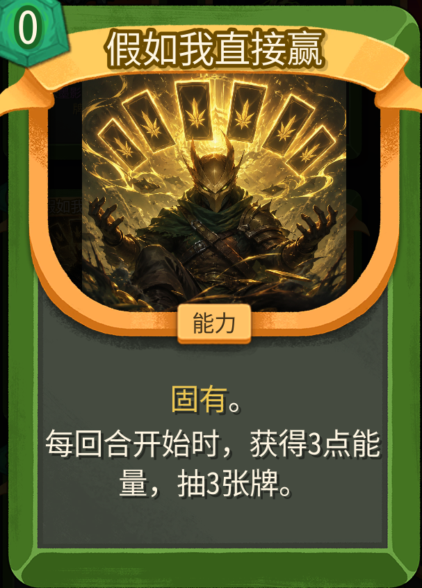
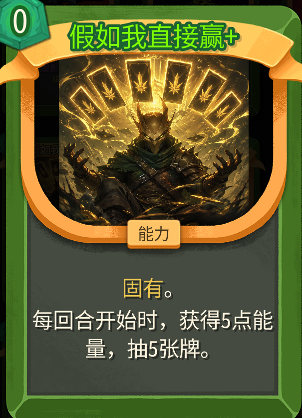

# 假如我直接赢

> Slay the Spire 2 的猎人（Silent）职业能力牌 mod。

开局一张超强能力牌：每回合开始时获得能量并抽牌，让你"直接赢"。 本mod完全vibecoding

## 卡牌展示

| 基础版 | 升级版 |
| :---: | :---: |
|  |  |

## 卡牌效果

| 属性 | 基础值 | 升级后 |
| --- | --- | --- |
| 名称 | 假如我直接赢 | 假如我直接赢+ |
| 费用 | 0 | 0 |
| 类型 | 能力（Power） | 能力（Power） |
| 稀有度 | 稀有（Rare） | 稀有（Rare） |
| 关键字 | 固有（Innate） | 固有（Innate） |
| 效果 | 每回合开始时获得 3 点能量，抽 3 张牌 | 每回合开始时获得 5 点能量，抽 5 张牌 |

进入战斗时，猎人初始卡组中的一张「打击」会被替换为本卡。

## 依赖

- Slay the Spire 2（Steam 版本）
- [Alchyr.Sts2.BaseLib](https://thunderstore.io/c/slay-the-spire-2/p/Alchyr/BaseLib/) ≥ 3.1.2

## 安装

1. 下载 Release 中的压缩包，解压后将 `Win/` 文件夹放到：

   ```
   <Steam>/steamapps/common/Slay the Spire 2/mods/
   ```

   目录中应包含 `Win.dll`、`Win.json`、`Win.pck` 三个文件。
2. 启动游戏，选择猎人角色，第一场战斗即可看到「假如我直接赢」出现在起手牌中。

## 本地构建

如果你想从源码构建（修改/二次开发）：

1. 安装依赖
   - [.NET SDK 9.0+](https://dotnet.microsoft.com/download)
   - [Godot 4.5.1 Mono 版](https://godotengine.org/download/archive/4.5.1-stable/)
   - 已正常安装 Slay the Spire 2，且已通过 Thunderstore 或手动方式安装好 [BaseLib](https://thunderstore.io/c/slay-the-spire-2/p/Alchyr/BaseLib/)
2. 配置本机路径
   - 把仓库根目录的 `Local.props.example` 复制为 `Local.props`
   - 修改其中 `Sts2Dir`（游戏安装目录）和 `GodotExe`（Godot 可执行文件路径）为你机器上的真实路径
   - `Local.props` 已在 `.gitignore` 中，不会被提交
   - 也可以改用环境变量 `STS2_DIR` / `GODOT_EXE`，效果等价
3. 构建
   - `dotnet build` 仅编译 C# 部分，并把 `Win.dll`、`Win.json` 复制到游戏 mods 目录
   - `dotnet publish -c ExportRelease` 在上一步基础上调用 Godot 导出 `Win.pck`，产物即可直接在游戏内加载


